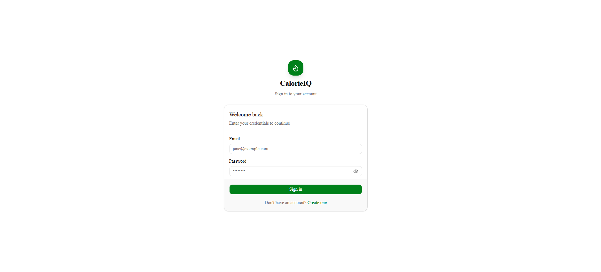
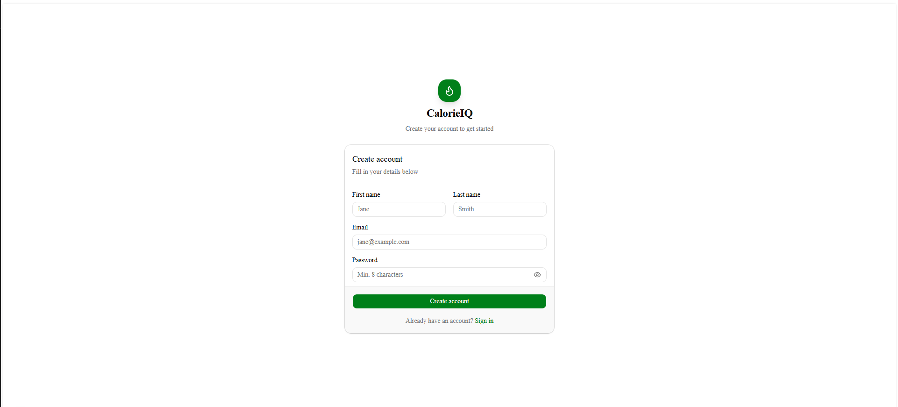
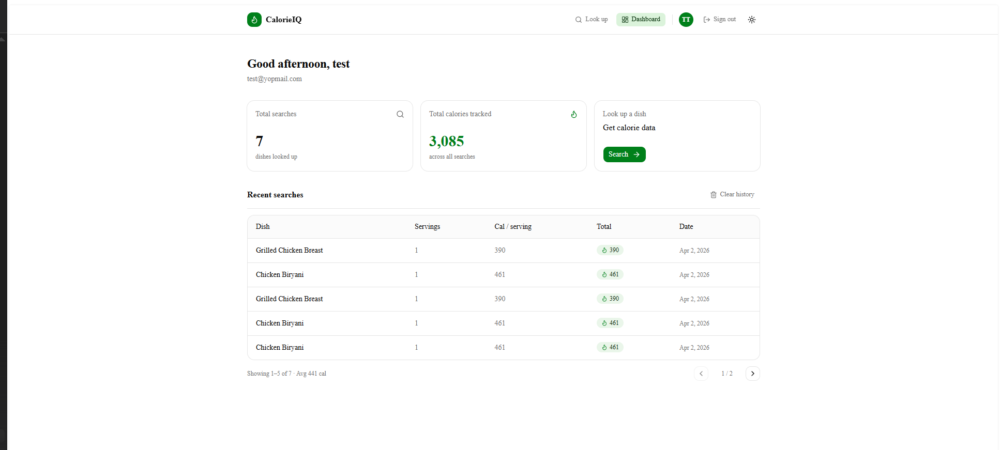
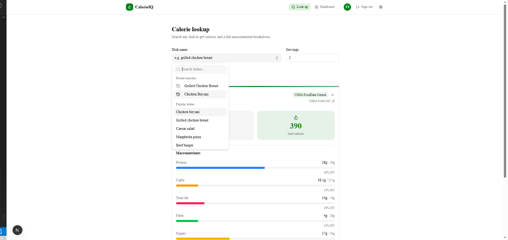
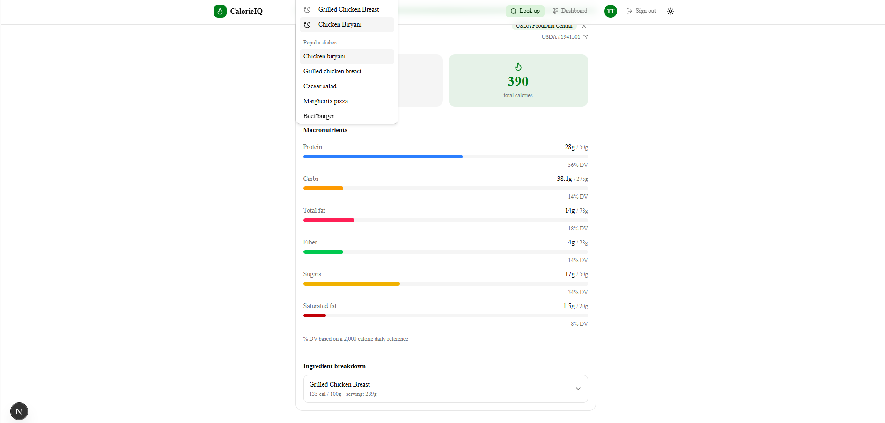
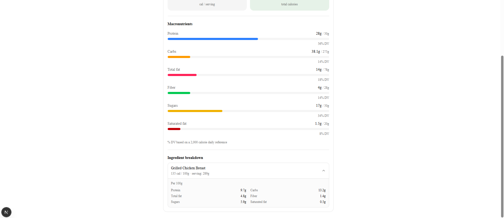
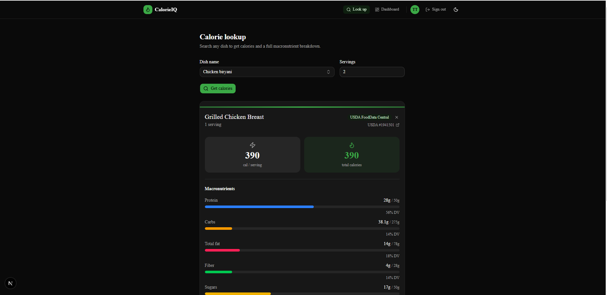
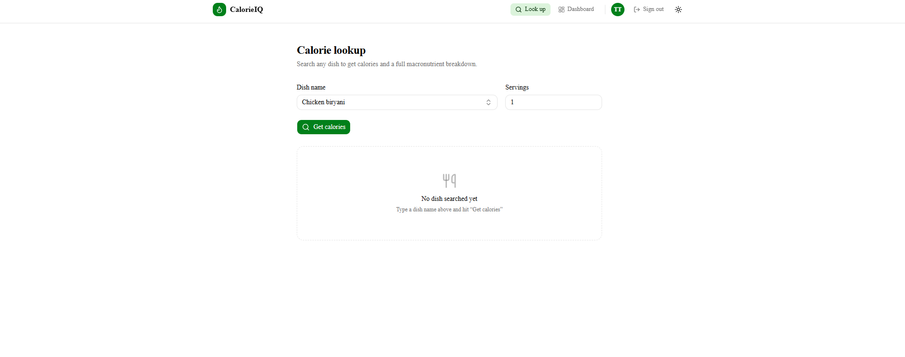

# CalorieIQ

A meal calorie lookup app built with Next.js 16 App Router. Search any dish to get calories, macronutrients, and ingredient breakdowns sourced from the USDA FoodData Central database.

## Features

- Dish calorie and macro lookup with progress bars (% daily value)
- Autocomplete with recent searches and popular dishes
- Per-serving and total macronutrient toggle
- Ingredient breakdown with per-100g nutrition data
- Search history with pagination on the dashboard
- Rate limit countdown (429 handling)
- JWT-based auth with Zustand persistence
- Dark / light / system theme

---

## Screenshots

| Login | Register |
|---|---|
|  |  |

| Dashboard | Calorie lookup |
|---|---|
|  |  |

| Result card | Ingredient breakdown |
|---|---|
|  |  |

| Dark mode | Empty state |
|---|---|
|  |  |

---

## Hosted app

> https://meal-calorie-frontend-akash.vercel.app/

---

## Local Development

### Prerequisites

- [Node.js 20+](https://nodejs.org)
- [pnpm](https://pnpm.io) — `npm install -g pnpm`

### Install and run

```bash
git clone <repo-url>
cd meal-calorie-frontend-akash
pnpm install
cp .env.example .env.local
```

Edit `.env.local`:

```env
NEXT_PUBLIC_API_BASE_URL=https://xpcc.devb.zeak.io
```

```bash
pnpm dev
```

Open [http://localhost:3000](http://localhost:3000).

---

## Docker

```bash
cp .env.example .env
# fill in NEXT_PUBLIC_API_BASE_URL in .env
docker compose up --build
```

The API URL is passed as a Docker build argument so Next.js can inline it at build time.

---

## Testing

```bash
pnpm test          # run once
pnpm test:watch    # watch mode
```

---

## Project Structure

```
src/
├── app/                  # Next.js App Router pages
│   ├── dashboard/        # Search history and stats
│   ├── calories/         # Dish lookup
│   ├── login/
│   └── register/
├── components/
│   ├── ui/               # shadcn/ui primitives
│   ├── AuthForm.tsx
│   ├── MealForm.tsx
│   ├── ResultCard.tsx
│   ├── DishAutocomplete.tsx
│   └── Header.tsx
├── hooks/
│   └── useAuthGuard.ts
├── lib/
│   ├── api.ts
│   └── validations.ts
├── stores/
│   ├── authStore.ts
│   └── mealStore.ts
└── types/
    └── index.ts
```

---

## Tech decisions and trade-offs

### Next.js App Router with server/client split
Server components export `metadata` for SEO; client components handle auth-guarded rendering. Pages like `/dashboard` and `/calories` are split into a server `page.tsx` (metadata only) and a `client.tsx` (actual UI), keeping the bundle clean.

### Zustand v5 + manual hydration flag
Zustand v5 removed `persist.hasHydrated()`. A `_hasHydrated` flag is set via `onRehydrateStorage` in `authStore` so `useAuthGuard` waits for rehydration before redirecting — prevents a flash redirect to `/login` on hard refresh.

### Custom theme provider instead of next-themes
React 19 warns when libraries inject `<script>` tags inside the component tree. `next-themes` does this, so it was replaced with a custom `Providers.tsx` and a `beforeInteractive` Next.js Script for zero-FOUC theme init.

### shadcn/ui on Base UI primitives
shadcn components use `@base-ui/react` as the primitive layer (not Radix UI). `asChild` is not supported, so trigger elements use `buttonVariants()` className directly on the primitive trigger rather than wrapping a `<Button>`.

### Zod v4 with `.trim()` at schema level
Whitespace-only inputs are rejected before hitting the API. `.trim()` is applied in the schema so the trimmed value is also what gets submitted, not the raw input.

### Rate limit UX
Every API response includes `RateLimit-Limit`, `RateLimit-Remaining`, and `RateLimit-Reset` headers. On 429, the `retryAfter` from the response body is prioritised over the header-computed value. A countdown timer disables the submit button until the window resets and clears the error automatically.

### No API proxy
Requests go directly from the browser to the backend with a Bearer token. The API base URL is public (`NEXT_PUBLIC_`) which is acceptable — the URL is not a secret and auth is handled by JWT.

### Vitest over Jest
Vitest shares the Vite transform pipeline, avoiding a separate Babel config for tests. `DishAutocomplete` is mocked in tests with a plain `<input>` to avoid `ResizeObserver` polyfilling from `cmdk`.

---

## API Error Handling

| Status | Behaviour |
|---|---|
| 400 | Field-level error on servings input |
| 401 | Clear auth, redirect to /login |
| 403 | Clear auth, redirect to /login |
| 404 | Alert — dish not found |
| 422 | Alert — food found but no nutrition data |
| 429 | Alert with live countdown until retry |
| 500 | Generic server error alert |
